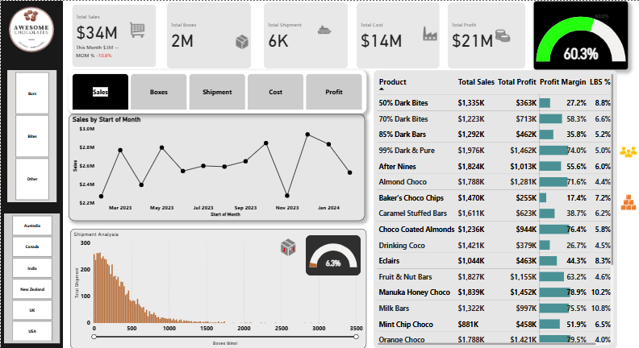

# 🍫 Awesome Chocolate Sales Analysis

## 📋 Project Overview
This Power BI project provides a 360-degree view involving a deep-dive analysis of Awesome Chocolates, a global confectionery distributor. By analyzing $34M in total sales, synthezing 6k shipments to identify profitability, sales performance, product trends, cost inefficiencies, and market expansion opportunities across multiple regions including the USA, UK, India, Canada, and Australia; This dashboard identifies a business that is highly profitable (60.3% margin) but currently facing a sharp short-term decline in momentum (-10.8% MoM). The analysis focuses on bridging the gap between high-volume shipping and net profitability.
 

## 🎯 Business Problem and Objective
The organization faced challenges in tracking real-time profit margins across diverse product lines (Bars, Bites, etc.) and understanding the correlation between shipment volumes and operational costs.

* **Objectives:**
* **Analyze Profitability:** Monitor the 60.3% global profit margin and identify underperforming products.
* **Operational Efficiency:** Evaluate shipment distributions and cost-to-sales ratios.
* **Market Intelligence:** Compare performance across different global territories and product categories.
* **Revenue Analysis:** Track total sales and shipment volumes (boxes) over time.
* **Geographical Insights:** Identify high-performing regions (APAC, Americas, Europe).
* **Product Performance:** Analyze sales by category (Bars, Bites, Others) and specific products.
* **Sales Team Evaluation:** Monitor individual salesperson performance and team rankings (Team Yummies, Delish, Jucies).

## 🔍 Key Insights and Findings
## A.Financial Performance (The "Big Numbers").
* **Total Revenue vs. Profit:** The organization generated $34M in revenue with a $21M profit, reflecting a healthy and robust 60.3% profit margin.
* **The MoM Red Flag:** Despite the strong margin, there is a -10.8% Month-on-Month decline, with the current month contributing only $3M, signaling a need for immediate marketing intervention
* **Cost Efficiency:** Total operational costs stand at $14M. The relationship between cost and profit is currently optimized at roughly 1.5:1 profit-to-cost ratio.

## B. Product Analytics & Profitability Matrix
   The product table reveals a massive variance in performance:
* **High-Performing Heroes:** Manuka Honey Choco (78.9% margin) and Orange Choco (79.5% margin) are the most efficient and top performer products in the portfolio.
* **The Low-Margin Risk:** Baker's Choco Chips stands out as a significant outlier with a meager 17.4% profit margin, despite having a relatively high "LBS %" (7.2%).
* **Efficiency Leaders:** Choco Coated Almonds yield a 76.4% profit margin while maintaining a lean shipping footprint (5.8% LBS).

## C. Shipment & Logistics Analysis:**
   The Shipment Analysis histogram shows a "Long Tail" distribution:
* **High Volume, Low Density:** The vast majority of shipments fall in the 0–500 boxes range.
* **Operational Strain:** With 6K total shipments and a total of 2M boxes, the average shipment size is relatively small, which explains the $14M cost overhead.

*  ### Logistics and Shipment Analysis**
The **Shipment Analysis** reveals a **"Long Tail" inefficiency** that is currently bleeding operational capital:

* **Shipment Count:** 6K total shipments.
* **Volume:** 2M total boxes.
* **The Constraint:** The histogram shows a heavy skew toward shipments of **<500 boxes**, indicating that the **$14M cost** is likely driven by high-frequency, small-batch logistics rather than optimized bulk shipping.

---

## 🧭 Strategic Recommendations (Solutions)
* **High-Margin Focus:**
- Action: Allocate 20% more marketing budget to Choco Coated Almonds and Manuka Honey Choco.
- Reason: These products have the highest "LBS %" and profit margins (76.4%+), offering the best ROI.

* **Cost Optimization:**
- Action: Review the logistics strategy for Baker's Choco Chips.
- Reason: This product has the lowest profit margin at 17.4%, likely due to high production or shipping costs relative to its price point.

* **Regional Strategy:**
- Action: Launch a "Recovery Campaign" in underperforming regions filtered by the interactive slicers to reverse the -10.8% MoM trend.

## 📊 Data Architecture
The report is built on a robust relational data model (Star Schema):
* **Shipment Data (Fact Table):** Contains transaction-level details (Sales, Boxes, Dates).
* **Product Dimension:** Detailed info on product categories and cost per box.
* **Geo Dimension:** Mapping countries to their respective global regions.
* **People Dimension:** Sales team hierarchy and personnel details.
* **Calendar Table:** A custom Date table used for Time Intelligence calculations (YoY, MTD, etc.).

## 🛠️ Tools & Tech Stack.
- **Power BI Desktop:** For ETL, Data Modeling, and Visualization.
- **Power Query:** Used for data cleaning and standardizing regional names.
- **DAX (Data Analysis Expressions):** Created custom measures for:
    - `Total Sales`
    - `Total Boxes`
    - `Profit Margin %`
    - `Average Sales per Shipment`
- **Interactive Features:** Bookmarks for switching between Sales, Boxes, Shipment, Cost, and Profit views.

## 💡 Business Insights
- **Top Region:** The **APAC** region (specifically India and New Zealand) shows the highest frequency of high-volume shipments.
- **Top Product:** Premium items like **85% Dark Bars** and **Raspberry Choco** are major revenue drivers.
- **Team Efficiency:** **Team Yummies** consistently leads in total sales volume across most quarters.

## 📂 How to Use
1.  **Download** the `Awesome Chocolate.pbix` file.
2.  Open it using [Power BI Desktop](https://powerbi.microsoft.com/desktop/).
3.  Interact with the **Slicers** on the left to filter by Region, Product, or Salesperson.

---

## 👤 Author
**[Uchechi Esther]**
*Data Analyst | Power BI Enthusiast*

---
*Note: This project uses sample data for demonstration purposes.*

